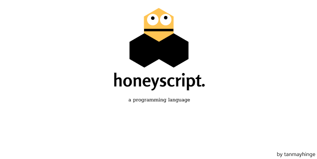

<center> 

 

</center>

honeyscript is a javascript based minimal programming language. It has features such as artihmetic functions, output, lambda functions etc.

---

this is the structure of execution:

.honey file -> parse.js -> .ast file -> generate.js -> .js file -> node -> result

---

### Steps to get started:
1. If you have git installed, ```git clone https://github.com/tanmayhinge/honeyscript.git``` .. This will download all files necessary for you to start writing honeyscript. 
2. Create a new file called ```hello.honey``` in the root of  ```./honeyscript/``` folder
3. Copy paste the below code examples or write your own and run command ```npm run honey hello.honey```

hello.honey

```js
out("Hello World!")
```

Below are some more honeyscript code-examples that cover all the features of honeyscript.

math.honey

```js
// comments can also be written like this
a = 5
b = 3
out(add(3 5))	// note how the nesting of brackets is done:)
out(sub(3 5))
out(mul(3 5))
out(div(3 5))
```

if.honey

```js
a = 3
b = 3
if(eq(a b)
    ()=>
        out("a equals b")
    ()=>
        out("a not equal to b")
)
```

lambda.honey

```js
solve = (n) =>
    if(eq(n 3)  
        () => 0 
        () =>   
            sub(n 3) 
        )
        
       
result = solve(10) 

out("The answer is" result)


// call solve() function and pass n=10 
// compares if n equals 3
// if yes, return 0
// else
// return n-3
//print result

```

feel free to fork and send a pull-request.. 
secret: checkout the  `library.js`  file, that can be easily expanded